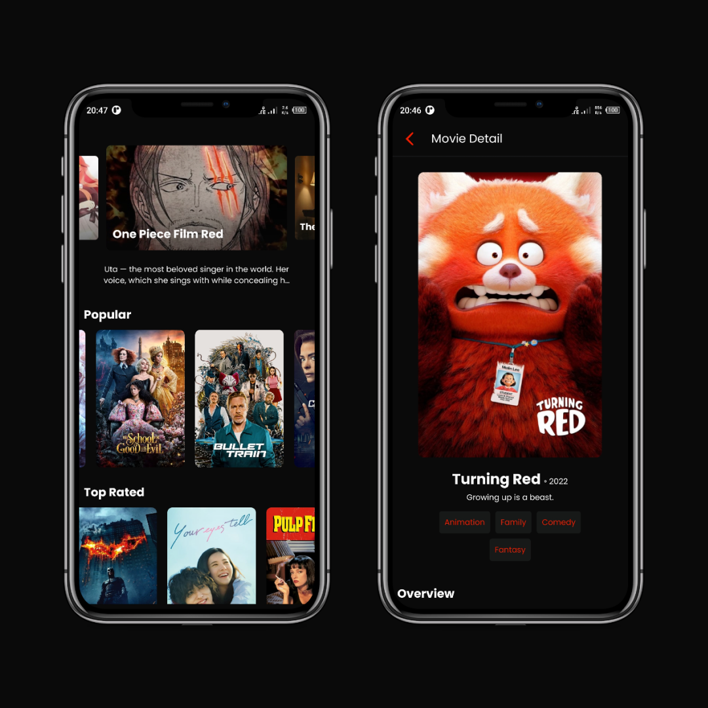

# Movies Apps

My simple project with Flutter
<!-- TODO: replace by a video intro -->



## How to install

**Step 1:**

Clone this repo:

```
git@github.com:labiebhn/movies-apps.git
```

**Step 2:**

Go to project root and execute the following command in console to get the required dependencies: 

```
yarn
```

**Step 3:**

Execute this command for install dependencies to iOS project.

```
npx pod-install
```

**Step 4:**

Start react native server.

```
yarn start
```


**Step 5:**

Next, start an app to connect to.

1. Android

```
yarn android
```

2. iOS

```
yarn ios
```